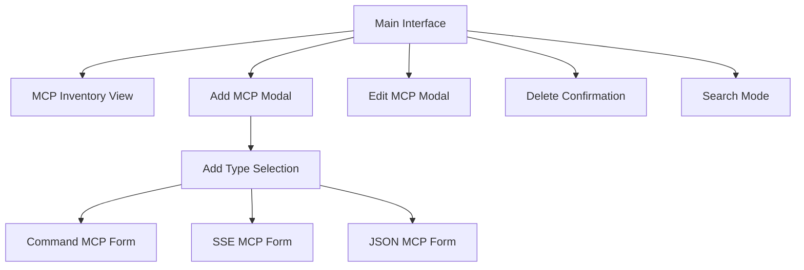
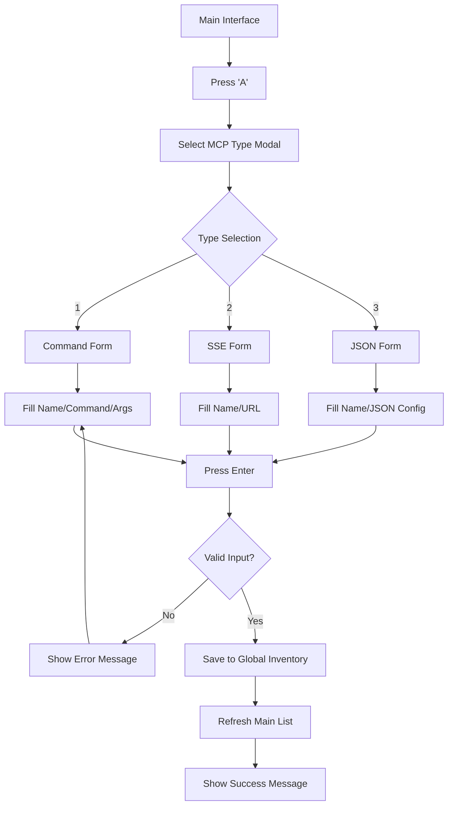
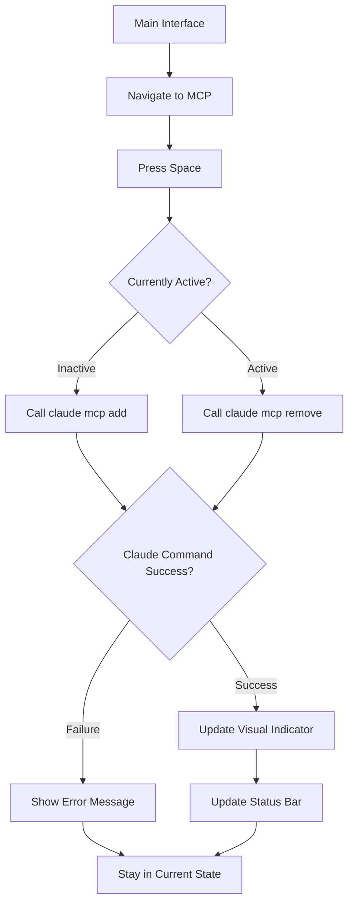
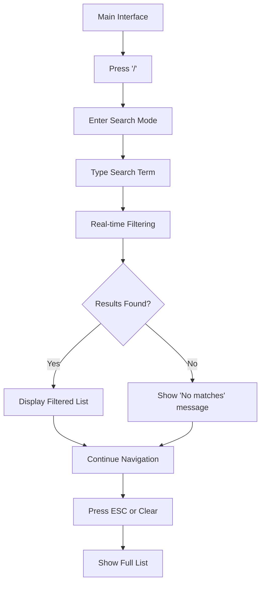

# MCP Manager CLI UI/UX Specification

This document defines the user experience goals, information architecture, user flows, and visual design specifications for MCP Manager CLI's TUI interface. It serves as the foundation for TUI development using Bubble Tea, ensuring a cohesive and user-centered terminal experience.

### Overall UX Goals & Principles

### Target User Personas

- **CLI Power User:** Developers who frequently use Claude Code and prefer keyboard-driven interfaces with maximum efficiency
- **Multi-Project Developer:** Developers working across multiple projects who need focused MCP context per project
- **MCP Explorer:** Developers who discover MCPs elsewhere and need an easy way to manage their personal toolkit

### Usability Goals

- **Learning Speed:** New users can complete core MCP operations within 2 minutes  
- **Efficiency:** Power users can toggle MCPs and switch contexts with single keystrokes
- **Memory:** Interface uses familiar terminal/vim-like patterns for instant recognition
- **Error Prevention:** Clear visual feedback prevents accidental destructive operations
- **Context Clarity:** Always clear which project context and which MCPs are active

### Design Principles

1. **Terminal Native** - Embrace TUI conventions, not web UI patterns
2. **Keyboard First** - Every action accessible via keyboard shortcuts
3. **Information Dense** - Maximize screen real estate usage for developer efficiency  
4. **Instant Feedback** - Every operation shows immediate visual response
5. **Context Aware** - Always show current project and active MCP state

### Change Log

| Date | Version | Description | Author |
| :--- | :------ | :---------- | :----- |
| 2025-06-29 | 1.0 | Initial TUI specification | Sally (UX) |

## Information Architecture (IA)

### Site Map / Screen Inventory



### Navigation Structure

**Primary Navigation:** Single unified interface with mode switching via keyboard shortcuts

**Secondary Navigation:** Modal dialogs for CRUD operations, search overlay

**Breadcrumb Strategy:** Status bar shows current context (project path, active count, last sync)

## User Flows

### Add New MCP to Inventory

**User Goal:** Add a discovered MCP to personal inventory for future use across projects

**Entry Points:** Main interface via 'A' key

**Success Criteria:** MCP successfully added to global inventory and available for activation

#### Flow Diagram



**Edge Cases & Error Handling:**

- Duplicate name: Show inline error with option to overwrite or rename
- Invalid command/URL: Real-time validation feedback
- Network issues (SSE): Timeout with retry option
- JSON syntax errors: Show specific line/column error

### Toggle MCP Activation for Current Project

**User Goal:** Enable or disable an MCP for the current project context

**Entry Points:** Main interface via Space key on selected MCP

**Success Criteria:** MCP activation state changed in Claude Code for current project

#### Flow Diagram



**Edge Cases & Error Handling:**

- Claude CLI not available: Show helpful installation message
- Permission errors: Show specific error and suggested fixes
- Network timeout: Show retry option with manual refresh
- Conflicting MCP configurations: Show merge resolution options

### Search and Filter MCPs

**User Goal:** Quickly find specific MCPs in a large inventory

**Entry Points:** Main interface via '/' key or typing in search field

**Success Criteria:** Filtered list shows only matching MCPs with search term highlighted

#### Flow Diagram



**Edge Cases & Error Handling:**

- No search results: Show helpful message with suggestion to check spelling
- Search with special characters: Handle regex-safe filtering
- Very long search terms: Truncate display but preserve full search

## Wireframes & Mockups

### Main Interface - MCP Inventory Manager

```
┌─── MCP Manager ───────────────────────────────────────────────────────────────────────────────────┐
│ [A]dd [E]dit [D]elete [Space]Toggle [R]efresh [Q]uit │ Search: [github     ] │ 3/30 active         │
├─────────────────────────────────────────────────────────────────────────────────────────────────┤
│ ● context7        ● github-mcp      ○ docker-mcp       ○ redis-mcp                                │
│ ● ht-mcp          ○ jira-mcp        ○ aws-mcp          ○ k8s-mcp                                  │
│ ○ filesystem      ○ confluence      ○ mongodb          ○ terraform                                │
│ ○ gitlab-mcp      ○ linear-mcp      ○ postgres         ○ elastic                                  │
│ ○ bitbucket       ○ asana-mcp       ○ notion-mcp       ○ anthropic                                │
│ ○ sourcegraph     ○ todoist         ○ slack-mcp        ○ openai-mcp                               │
│ ○ codeberg        ○ calendar        ○ discord          ○ gemini-mcp                               │
│ ○ gitness         ○ email-mcp       ○ teams-mcp        ○ claude-mcp                               │
│ ○ fossil-mcp      ○ browser         ○ zoom-mcp                                                    │
├─────────────────────────────────────────────────────────────────────────────────────────────────┤
│ Project: /web-app • Claude sync: 2m ago • ● Active in Claude Code  ○ Available in inventory       │
└─────────────────────────────────────────────────────────────────────────────────────────────────┘
```

**Navigation:** `↑↓` - Navigate within column, `←→` - Move between columns, `Tab` - Jump to search field, `Space` - Toggle selected MCP, `A/E/D` - Add/Edit/Delete operations

### Add MCP Type Selection Modal

```
┌─── MCP Manager ───────────────────────────────────────────────────────────────────────────────────┐
│ [A]dd [E]dit [D]elete [Space]Toggle [R]efresh [Q]uit │ Search: [           ] │ 3/30 active         │
├─────────────────────────────────────────────────────────────────────────────────────────────────┤
│ ● context7     [SSE]    │ ● github-mcp  [CMD]    │ ○ docker-mcp  [CMD]    │ ○ redis-mcp   [CMD]    │
│ ● ht-mcp       [CMD]    │ ○ jira-mcp    [CMD]    │ ○ aws-mcp     [JSON]   │ ○ k8s-mcp     [CMD]    │
│ ○ filesystem   [CMD]    │ ┌─── Add New MCP ───────────────────────────┐ │ ○ terraform   [CMD]    │
│ ○ gitlab-mcp   [CMD]    │ │ Select MCP Type:                          │ │ ○ elastic     [JSON]   │
│ ○ bitbucket    [CMD]    │ │                                           │ │ ○ anthropic   [HTTP]   │
│ ○ sourcegraph  [CMD]    │ │ 1. Command/Binary (most common)          │ │ ○ openai-mcp  [HTTP]   │
│ ○ codeberg     [CMD]    │ │ 2. SSE Server (HTTP/WebSocket)            │ │ ○ gemini-mcp  [HTTP]   │
│ ○ gitness      [CMD]    │ │ 3. JSON Configuration                     │ │ ○ claude-mcp  [HTTP]   │
│ ○ fossil-mcp   [CMD]    │ │                                           │ │                        │
├─────────────────────────│ │ [1-3] Select   [ESC] Cancel               │ ├─────────────────────────┤
│ Project: /web-app • Cla │ └───────────────────────────────────────────┘ │ Available in inventory  │
└─────────────────────────────────────────────────────────────────────────────────────────────────┘
```

**Interaction:** `1/2/3` - Quick selection, `↑↓` - Navigate options, `Enter` - Confirm selection, `ESC` - Cancel and return

### Add Command MCP Form

```
┌─── MCP Manager ───────────────────────────────────────────────────────────────────────────────────┐
│ [A]dd [E]dit [D]elete [Space]Toggle [R]efresh [Q]uit │ Search: [           ] │ 3/30 active         │
├─────────────────────────────────────────────────────────────────────────────────────────────────┤
│ ● context7     [SSE]    │ ● github-mcp  [CMD]    │ ○ docker-mcp  [CMD]    │ ○ redis-mcp   [CMD]    │
│ ● ht-mcp       [CMD]    │ ○ jira-mcp    [CMD]    │ ○ aws-mcp     [JSON]   │ ○ k8s-mcp     [CMD]    │
│ ○ filesystem   [CMD]    │ ┌─── Add Command MCP ───────────────────────┐ │ ○ terraform   [CMD]    │
│ ○ gitlab-mcp   [CMD]    │ │ Name: [new-mcp-name           ]           │ │ ○ elastic     [JSON]   │
│ ○ bitbucket    [CMD]    │ │ Command: [npx @my/mcp-server  ]           │ │ ○ anthropic   [HTTP]   │
│ ○ sourcegraph  [CMD]    │ │ Args: [--token ${TOKEN}       ] (optional)│ │ ○ openai-mcp  [HTTP]   │
│ ○ codeberg     [CMD]    │ │                                           │ │ ○ gemini-mcp  [HTTP]   │
│ ○ gitness      [CMD]    │ │ [Enter] Add    [ESC] Cancel               │ │ ○ claude-mcp  [HTTP]   │
│ ○ fossil-mcp   [CMD]    │ └───────────────────────────────────────────┘ │                        │
├─────────────────────────────────────────────────────────────────────────────────────────────────┤
│ Project: /web-app • Claude sync: 2m ago • ● Active in Claude Code  ○ Available in inventory       │
└─────────────────────────────────────────────────────────────────────────────────────────────────┘
```

**Interaction:** `Tab` - Navigate between fields, `Enter` - Submit (when valid), `ESC` - Cancel and return, Real-time validation feedback

### Add SSE MCP Form

```
┌─── Add SSE MCP ───────────────────────────────────────────────────────────────────────────────────┐
│ Name: [context7-clone             ]                                                                │
│ URL:  [https://api.example.com/sse]                                                                │
│ [Enter] Add    [ESC] Cancel                                                                         │
└─────────────────────────────────────────────────────────────────────────────────────────────────┘
```

### Search Active State

```
┌─── MCP Manager ───────────────────────────────────────────────────────────────────────────────────┐
│ [A]dd [E]dit [D]elete [Space]Toggle [R]efresh [Q]uit │ Search: [github     ] │ 2 matches found     │
├─────────────────────────────────────────────────────────────────────────────────────────────────┤
│ ● **github**-mcp      ○ **github**-api                                                              │
│ [ESC] to clear search                                                                                 │
├─────────────────────────────────────────────────────────────────────────────────────────────────┤
│ Project: /web-app • Claude sync: 2m ago • Search: "github" • 2 of 30 MCPs shown                   │
└─────────────────────────────────────────────────────────────────────────────────────────────────┘
```

### Error State Example

```
┌─── MCP Manager ───────────────────────────────────────────────────────────────────────────────────┐
│ [A]dd [E]dit [D]elete [Space]Toggle [R]efresh [Q]uit │ Search: [           ] │ 3/30 active         │
├─────────────────────────────────────────────────────────────────────────────────────────────────┤
│ ● context7     [SSE]    │ ● github-mcp  [CMD]    │ ○ docker-mcp  [CMD]    │ ○ redis-mcp   [CMD]    │
│ ● ht-mcp       [CMD]    │ ○ jira-mcp    [CMD]    │ ○ aws-mcp     [JSON]   │ ○ k8s-mcp     [CMD]    │
│ ○ filesystem   [CMD]    │ ○ confluence  [SSE]    │ ○ mongodb     [CMD]    │ ○ terraform   [CMD]    │
├─────────────────────────────────────────────────────────────────────────────────────────────────┤
│ ❌ Error: Claude CLI not found. Install with: npm install -g @anthropics/claude-code              │
└─────────────────────────────────────────────────────────────────────────────────────────────────┘
```

### Responsive - Narrow Terminal (2 columns)

```
┌─── MCP Manager ───────────────────────────────────────────────┐
│ [A]dd [D]el [Space]Toggle [Q]uit │ Search: [    ] │ 3/30 active │
├───────────────────────────────────────────────────────────────┤
│ ● context7        ○ docker-mcp                                   │
│ ● ht-mcp          ○ aws-mcp                                     │
│ ● github-mcp      ○ mongodb                                    │
│ ○ filesystem      ○ terraform                                  │
│ ○ gitlab-mcp      ○ postgres                                   │
│ ○ jira-mcp        ○ elastic                                    │
├───────────────────────────────────────────────────────────────┤
│ Project: /web-app • 3/30 active • Sync: 2m ago                 │
└───────────────────────────────────────────────────────────────┘
```

## Component Library / Design System

**Design System Approach:** Terminal-native components using Bubble Tea patterns and ASCII art styling

### Core Components

#### StatusIndicator

**Purpose:** Show MCP activation state with clear visual distinction

**Variants:** Active (● green), Inactive (○ gray), Loading (◐ animated)

**States:** Default, Highlighted (when selected), Error (red)

**Usage Guidelines:**
- Always pair with MCP name for clarity
- Use consistent color coding across interface
- Animate transitions between states for user feedback

#### TypeBadge

**Purpose:** Identify MCP type at a glance in dense list view

**Variants:** [CMD], [SSE], [JSON], [HTTP]

**States:** Default, Dimmed (when MCP inactive)

**Usage Guidelines:**
- Keep badges short (3-4 characters max)
- Use consistent bracket formatting
- Color-code by type for advanced users

#### ModalDialog

**Purpose:** Overlay forms and confirmations without losing main context

**Variants:** Form Modal, Confirmation Modal, Info Modal

**States:** Default, Loading, Error

**Usage Guidelines:**
- Always include ESC to cancel
- Use consistent border styling
- Center on screen with backdrop
- Show loading states for async operations

#### SearchField

**Purpose:** Real-time filtering with clear input/output relationship

**Variants:** Empty State, Active Input, Results Found, No Results

**States:** Default, Focused, Disabled

**Usage Guidelines:**
- Show placeholder text when empty
- Highlight matching text in results
- Clear button or ESC to reset
- Show result count when appropriate

## Visual Style

### Colors
- **Active:** Green (● active MCPs)
- **Inactive:** Gray (○ available MCPs)  
- **Selected:** Blue/Cyan (current selection)
- **Error:** Red (errors, warnings)

### Symbols
- ● ○ for status (active/inactive)
- [CMD] [SSE] [JSON] for type badges
- Standard terminal borders and separators

## Accessibility Requirements

### Key Requirements

- Full keyboard navigation (no mouse needed)
- Clear visual contrast between active/inactive states
- Meaningful error messages with actionable guidance

## Responsiveness Strategy

### Breakpoints

| Breakpoint | Min Columns | Max Columns | Adaptation Strategy     |
| :--------- | :---------- | :---------- | :---------------------- |
| Narrow     | 60          | 79          | 2 columns, compact UI   |
| Standard   | 80          | 119         | 3 columns (primary)     |
| Wide       | 120         | 200         | 3 columns + more spacing|
| Ultra-wide | 200+        | -           | 3 columns + extra info  |

### Adaptation Patterns

**Layout Changes:** Column count reduces on narrow terminals, extra spacing on wide

**Navigation Changes:** Same keyboard shortcuts across all sizes

**Content Priority:** MCP names always visible, type badges may be abbreviated

**Interaction Changes:** No changes - keyboard navigation consistent across sizes

## Animation & Micro-interactions

### Key Interactions

- **Loading States:** Simple spinner for async operations
- **Visual Feedback:** Status changes show immediate response
- **Modal Behavior:** Overlays appear/disappear cleanly

## Next Steps

### Immediate Actions

1. **Review with PM:** Validate flows match PRD requirements
2. **Technical Feasibility:** Confirm Bubble Tea can support all interactions
3. **Developer Handoff:** Create implementation priority order

### Design Handoff Checklist

- [x] All user flows documented with edge cases
- [x] Component behavior and states defined
- [x] Responsive strategy for terminal sizes
- [x] Keyboard navigation fully specified
- [x] Error handling patterns established
- [x] Performance requirements set

## Checklist Results

TUI specification complete and ready for development handoff. All major interaction patterns defined with terminal-native approach prioritizing keyboard efficiency and information density.