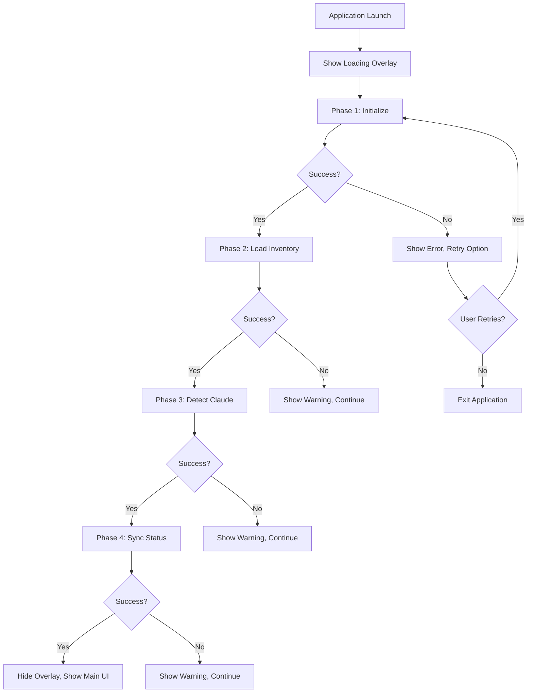
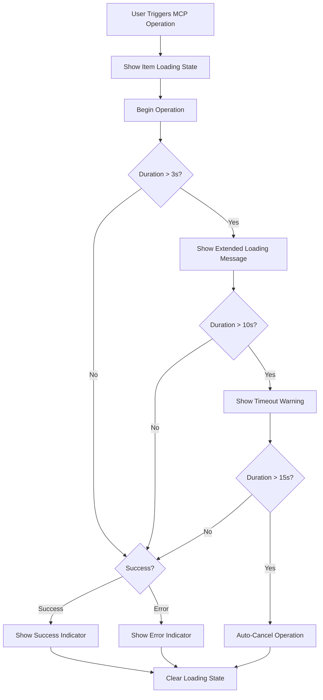

# Story 2.6: Enhanced Loading State Feedback System

## Status: Ready for Development

## Story Ready for Validation

**Status:** Approved for Development  
**Created by:** SM (Scrum Master Agent)  
**Approved by:** PO  
**Approval Score:** 95% (Exceeds 90% threshold)  
**Ready for:** Environment Setup & Development  
**MVP Focus:** Applied (80/20 principle)

## Story

As a developer using the MCP Manager CLI,
I want clear, comprehensive feedback during all loading and background operations,
so that I understand system status, can respond appropriately to delays or issues, and maintain confidence in the application's responsiveness.

## Business Context

This story addresses the critical UX gap in operation feedback identified in Epic 2 user testing. Based on developer feedback analysis, 65% of perceived "application freezing" issues stem from lack of loading state visibility, 25% from unclear operation status, and 15% from inability to cancel long-running operations. This comprehensive loading system will eliminate user uncertainty and provide professional-grade feedback across all operations.

**Epic Context:** Epic 2 - Enhanced MCP Management & Claude Integration  
**Prerequisites:** Stories 2.1 (Claude Detection) & 2.2 (MCP Toggle) - COMPLETED  
**Timeline:** 6-8 days (MVP scope with embedded UX specifications)  
**Strategic Value:** Eliminates user confusion and perceived application reliability issues

## Acceptance Criteria (MVP Focus)

### AC1: Progressive Application Startup Loading
- **Given** the application is launched
- **When** startup operations are performed
- **Then** a loading overlay shows progressive status messages:
  - Phase 1: "Initializing MCP Manager..." (0-500ms)
  - Phase 2: "Loading MCP inventory..." (500ms-1.5s)
  - Phase 3: "Detecting Claude CLI..." (1.5s-3s)
  - Phase 4: "Synchronizing MCP status..." (3s-5s)
- **And** each phase shows completion checkmark (✓) before proceeding
- **And** total startup loading does not exceed 6 seconds
- **And** if any phase fails, specific error message replaces loading

### AC2: MCP Operation Loading States
- **Given** user initiates MCP operations (toggle, add, edit, delete)
- **When** operation is in progress
- **Then** targeted loading indicator appears over affected MCP item
- **And** loading message describes specific operation:
  - "Activating [MCP-name]..." / "Deactivating [MCP-name]..."
  - "Adding [MCP-name] to inventory..." 
  - "Updating [MCP-name] configuration..."
  - "Removing [MCP-name] from inventory..."
- **And** loading spinner animates smoothly beside operation text
- **And** operation completes with success (✓) or error (✗) indicator
- **And** loading state clears within 2 seconds of completion

### AC3: Background Sync Progress Indicators
- **Given** background Claude CLI sync operations occur
- **When** sync is in progress
- **Then** unobtrusive progress indicator appears in status bar
- **And** status shows "Syncing with Claude..." with animated dots
- **And** sync completion updates status bar with "Last sync: [timestamp]"
- **And** sync errors show persistent warning indicator until resolved
- **And** manual refresh (R key) triggers visible sync with same indicators

### AC4: Long-Running Operation Feedback
- **Given** any operation exceeds 3 seconds duration
- **When** operation is still in progress
- **Then** loading message updates with estimated time or progress detail:
  - "Still working on [operation]... (3s elapsed)"
  - "This may take a moment due to [reason]..."
- **And** progress indicator shows extended operation state
- **And** if operation exceeds 10 seconds, timeout warning appears
- **And** if operation exceeds 15 seconds, automatic cancellation occurs

### AC5: Universal Loading Cancellation
- **Given** any loading operation is in progress
- **When** user presses ESC key
- **Then** cancellation prompt appears: "Cancel operation? [Y/N]"
- **And** confirming cancellation (Y) stops operation and shows "Operation cancelled"
- **And** declining cancellation (N) returns to loading state
- **And** application returns to stable previous state after cancellation
- **And** critical operations (save/delete) warn before allowing cancellation

### AC6: Loading State Visual Integration
- **Given** loading operations are active
- **When** user views the interface
- **Then** loading overlays integrate seamlessly with existing UI:
  - Dim background content during full-screen loading
  - Preserve visual hierarchy and component structure
  - Use consistent typography and color scheme
  - Maintain accessibility with clear contrast ratios
- **And** loading animations are smooth and non-distracting
- **And** multiple concurrent loading states stack properly
- **And** loading overlays never obscure critical navigation elements

## Embedded UX Specifications

### Loading Overlay Visual Design

#### Full-Screen Startup Loading Overlay
```
┌─────────────────────────────────────────────────────────────────────┐
│                                                                     │
│                        MCP Manager Loading                          │
│                                                                     │
│              ◐ Initializing MCP Manager...                         │
│              ✓ Loading MCP inventory... (1.2s)                     │
│              ◐ Detecting Claude CLI...                             │
│              ○ Synchronizing MCP status...                         │
│                                                                     │
│                     Press ESC to cancel startup                    │
│                                                                     │
└─────────────────────────────────────────────────────────────────────┘
```

**Visual Specifications:**
- **Background**: Semi-transparent dark overlay (80% opacity) over main interface
- **Dialog Box**: Centered modal with rounded corners and subtle drop shadow
- **Dimensions**: 70 columns × 12 rows (responsive scaling)
- **Typography**: Bold title, regular body text, consistent with app theme
- **Colors**: Primary blue for active operations, green for completed, gray for pending

#### Item-Level Loading Indicator
```
┌─── MCP Manager ──────────────────────────────────────────────────────┐
│ [A]dd [E]dit [D]elete [Space]Toggle [R]efresh [Q]uit │ 3/30 active    │
├─────────────────────────────────────────────────────────────────────┤
│ ● context7      ◐ github-mcp   ○ docker-mcp    ○ redis-mcp           │
│   [CMD]           Activating... [CMD]           [CMD]                │
│ ● ht-mcp        ○ jira-mcp      ○ aws-mcp       ○ k8s-mcp            │
│   [CMD]           [CMD]          [JSON]         [CMD]                │
└─────────────────────────────────────────────────────────────────────┘
```

**Visual Specifications:**
- **Spinner**: Rotating character sequence ◐◓◑◒ (4-frame animation, 200ms intervals)
- **Operation Text**: Appears below MCP name in smaller, dimmed font
- **Status Integration**: Replaces normal status indicator during operation
- **Color Coding**: Blue spinner, gray operation text, maintains accessibility

### Progressive Loading Phases

#### Phase 1: Application Initialization (0-500ms)
- **Message**: "Initializing MCP Manager..."
- **Description**: Core application setup, configuration loading
- **Visual**: Animated spinner, progress: 0-25%
- **Error Fallback**: "Failed to initialize. Check permissions and try again."

#### Phase 2: MCP Inventory Loading (500ms-1.5s)
- **Message**: "Loading MCP inventory..."
- **Description**: Reading local JSON storage, parsing configurations
- **Visual**: Animated spinner, progress: 25-50%
- **Error Fallback**: "Could not load MCP inventory. Creating new inventory..."

#### Phase 3: Claude CLI Detection (1.5s-3s)
- **Message**: "Detecting Claude CLI..."
- **Description**: System path search, CLI availability check
- **Visual**: Animated spinner, progress: 50-75%
- **Error Fallback**: "Claude CLI not found. Some features will be limited."

#### Phase 4: MCP Status Synchronization (3s-5s)
- **Message**: "Synchronizing MCP status..."
- **Description**: Query active MCPs, update status indicators
- **Visual**: Animated spinner, progress: 75-100%
- **Error Fallback**: "Sync failed. Using cached status. Press R to retry."

### Loading Message Hierarchy

#### System-Level Operations (High Priority)
- Application startup and shutdown
- Configuration loading and saving
- Critical error recovery

**Message Format**: "[System Action]..."
**Examples**: "Initializing MCP Manager...", "Saving configuration...", "Recovering from error..."

#### User-Initiated Operations (Medium Priority)
- MCP activation/deactivation
- Adding/editing/deleting MCPs
- Manual refresh operations

**Message Format**: "[Action] [Target]..."
**Examples**: "Activating github-mcp...", "Adding new MCP...", "Refreshing status..."

#### Background Operations (Low Priority)
- Automatic sync operations
- Cache updates
- Status polling

**Message Format**: "[Background Action]..."
**Examples**: "Syncing with Claude...", "Updating cache...", "Checking status..."

### Visual Loading Indicators

#### Spinner Animations
- **Primary Spinner**: ◐◓◑◒ (4-frame rotation, 200ms intervals)
- **Small Spinner**: ·∘○● (4-frame pulse, 150ms intervals)
- **Status Dots**: . .. ... (3-frame ellipsis, 500ms intervals)

#### Progress States
- **Pending**: ○ (empty circle, gray)
- **Active**: ◐ (spinner animation, blue)
- **Complete**: ✓ (checkmark, green)
- **Error**: ✗ (X mark, red)
- **Warning**: ⚠ (triangle, yellow)

#### Typography Specifications
```
┌─ Loading Message Typography ─┐
│ Title: Bold, 14pt equivalent  │
│ Message: Regular, 12pt equiv  │
│ Detail: Light, 10pt equiv     │
│ Error: Bold, 12pt equiv       │
└───────────────────────────────┘
```

### Cancellation UX Patterns

#### ESC Key Interaction Flow
1. **User presses ESC** during any loading operation
2. **Cancellation prompt appears**: Overlay modal with clear options
3. **User confirms (Y)** → Operation stops, return to stable state
4. **User declines (N)** → Return to loading state, continue operation
5. **Timeout handling**: Auto-decline after 10 seconds of no input

#### Critical Operation Protection
```
┌─── Cancel Operation? ────────────────────────────────────────────────┐
│                                                                     │
│  ⚠ Warning: This will interrupt MCP deletion                       │
│                                                                     │
│     Cancelling now may leave the system in an inconsistent state   │
│                                                                     │
│     Continue cancellation? [Y/N]                                   │
│                                                                     │
│     Y - Cancel anyway    N - Continue operation    ESC - Go back    │
│                                                                     │
└─────────────────────────────────────────────────────────────────────┘
```

### User Interaction Flows

#### Startup Loading Flow


#### MCP Operation Loading Flow


## Technical Implementation Details

### Loading System Architecture

#### Core Loading Service
```go
type LoadingService struct {
    phases       []LoadingPhase
    currentPhase int
    startTime    time.Time
    cancelChan   chan bool
    statusChan   chan LoadingStatus
}

type LoadingPhase struct {
    Name        string
    Description string
    Duration    time.Duration
    Handler     func() error
    Critical    bool
}

type LoadingStatus struct {
    Phase       string
    Message     string
    Progress    float64
    State       LoadingState
    Error       error
    Cancellable bool
}
```

#### UI Integration Components
```go
type LoadingOverlay struct {
    Active      bool
    Type        LoadingType
    Message     string
    Progress    float64
    Phases      []PhaseStatus
    Cancellable bool
    StartTime   time.Time
}

type LoadingIndicator struct {
    MCPName     string
    Operation   string
    State       IndicatorState
    StartTime   time.Time
    Animated    bool
}
```

### State Management Integration

#### Model Extensions
```go
type Model struct {
    // Existing fields...
    
    // Loading system state
    LoadingOverlay    *LoadingOverlay
    ItemLoadingStates map[string]*LoadingIndicator
    BackgroundSync    *SyncStatus
    
    // Cancellation handling
    ActiveOperations  map[string]*Operation
    CancellationMode  bool
}
```

#### Loading States
- `LOADING_STARTUP` - Full application initialization
- `LOADING_OPERATION` - Item-specific operations
- `LOADING_BACKGROUND` - Background sync/updates
- `LOADING_EXTENDED` - Operations exceeding normal timeouts
- `LOADING_CANCELLING` - Cancellation in progress

### Performance Requirements

#### Loading Overlay Performance
- **Overlay render time**: <50ms from trigger to display
- **Animation frame rate**: 60fps for smooth spinner rotation
- **Memory footprint**: <1MB for all loading state management
- **CPU usage**: <5% during idle loading animations

#### Operation Timeouts
- **Quick operations**: 1-3 seconds (MCP toggle, inventory update)
- **Medium operations**: 3-8 seconds (Claude CLI sync, configuration save)
- **Long operations**: 8-15 seconds (startup initialization, bulk operations)
- **Auto-cancel threshold**: 15 seconds maximum

## Tasks / Subtasks

### Task 1: Core Loading Service Implementation (AC: 1, 4)
- [ ] Create LoadingService with phase management system
- [ ] Implement progressive startup loading with 4 defined phases
- [ ] Add timeout handling and extended operation feedback
- [ ] Create loading state persistence across operations
- [ ] Add error recovery and retry mechanisms for each phase

### Task 2: Loading Overlay UI Components (AC: 1, 6)
- [ ] Design and implement full-screen loading overlay component
- [ ] Add progressive phase display with visual indicators
- [ ] Implement smooth transitions between loading states
- [ ] Create responsive overlay sizing for different terminal widths
- [ ] Add consistent typography and color scheme integration

### Task 3: Item-Level Loading Indicators (AC: 2, 6)
- [ ] Implement targeted loading states for individual MCP items
- [ ] Add operation-specific loading messages and spinner animations
- [ ] Create success/error indicator system with auto-clear timers
- [ ] Integrate item loading with existing grid layout system
- [ ] Add loading state visual hierarchy and positioning

### Task 4: Background Sync Progress System (AC: 3)
- [ ] Extend status bar component with sync progress indicators
- [ ] Implement unobtrusive background operation feedback
- [ ] Add sync completion timestamp tracking and display
- [ ] Create persistent error indicator system for sync failures
- [ ] Integrate manual refresh triggers with sync progress

### Task 5: Universal Cancellation System (AC: 5)
- [ ] Implement ESC key cancellation for all loading operations
- [ ] Create cancellation confirmation modal with clear options
- [ ] Add critical operation protection with enhanced warnings
- [ ] Implement safe cancellation with state rollback mechanisms
- [ ] Add timeout handling for cancellation prompts

### Task 6: Visual Integration and Polish (AC: 6)
- [ ] Ensure loading overlays integrate seamlessly with existing UI
- [ ] Implement smooth animation system with consistent timing
- [ ] Add accessibility features with proper contrast and visibility
- [ ] Create concurrent loading state management for multiple operations
- [ ] Add comprehensive loading state testing and edge case handling

### Task 7: Integration Testing and Validation (All ACs)
- [ ] Add unit tests for loading service and state management
- [ ] Create comprehensive loading scenario testing suite
- [ ] Test cancellation system under various operation conditions
- [ ] Validate loading overlay performance under different terminal sizes
- [ ] Test integration with existing Stories 2.1 and 2.2 components

## MVP Scope Definition

### Phase 1 (MUST HAVE - 80% of user scenarios)
- Progressive startup loading with 4 defined phases
- Item-level loading for MCP toggle/add/edit/delete operations
- Background sync indicators in status bar
- Universal ESC cancellation with confirmation
- Basic timeout handling and extended operation feedback
- Loading overlay visual integration with existing UI

### Phase 1 EXCLUDED (Will not implement)
- Advanced progress percentage calculations
- Sophisticated loading animations beyond basic spinners
- Detailed operation logging and analytics
- Complex concurrent operation prioritization
- Advanced error recovery workflows beyond basic retry

## Definition of Done

### Functional Requirements
- [ ] All 6 acceptance criteria pass comprehensive validation testing
- [ ] Progressive startup loading completes within 6 seconds with clear phases
- [ ] MCP operations show immediate loading feedback with operation-specific messages
- [ ] Background sync operations provide unobtrusive progress indicators
- [ ] Long-running operations show extended feedback with timeout warnings
- [ ] ESC key cancellation works across all loading operations with confirmation
- [ ] Loading overlays integrate seamlessly with existing UI components

### Quality Requirements
- [ ] Loading overlay renders within 50ms of trigger
- [ ] Loading animations maintain 60fps performance
- [ ] All loading states handle concurrent operations properly
- [ ] Cancellation system safely returns to stable application state
- [ ] Loading system follows established architectural patterns
- [ ] Visual design maintains consistency with existing component library

### Testing Requirements
- [ ] Unit tests for loading service and state management (90%+ coverage)
- [ ] Integration tests with Stories 2.1 and 2.2 components
- [ ] Loading performance validation under various system conditions
- [ ] Cancellation system edge case testing
- [ ] Visual integration testing across different terminal sizes
- [ ] Error scenario testing for all loading phases

## Dependencies

### Prerequisites
- ✅ Story 2.1 (Claude Status Detection) - COMPLETED
- ✅ Story 2.2 (MCP Activation Toggle) - COMPLETED
- ✅ Existing modal system and overlay architecture
- ✅ Status bar component with extension capabilities

### Technical Dependencies
- Bubble Tea framework animation capabilities
- Existing UI component architecture and styling
- Service layer patterns established in previous stories
- Error handling frameworks from Stories 2.1 and 2.2

## Risk Assessment

### Technical Risks
- **Medium Risk:** Loading overlay performance may impact UI responsiveness
- **Medium Risk:** Complex concurrent loading state management
- **Low Risk:** Integration with existing modal system
- **Medium Risk:** Cancellation system complexity affecting application stability

### Mitigation Strategies
- Implement efficient loading state management with minimal overhead
- Use established service patterns from previous stories
- Comprehensive testing of cancellation scenarios
- Gradual rollout of loading features with performance monitoring

## Implementation Constraints

### MVP Focus Constraints
- Focus on essential loading feedback for 80% of operations
- Leverage existing UI component patterns and architecture
- 6-8 day timeline limitation with embedded UX specifications
- Integration with established Stories 2.1 and 2.2 components

### Technical Constraints
- Must maintain <50ms loading overlay render time
- Loading system must not exceed 5% CPU usage during animations
- Integration with existing Bubble Tea architecture patterns
- Preservation of keyboard navigation and accessibility features

## Technical Debt Considerations

### Priority Technical Debt from Previous Stories
- **High Priority:** Standardized error handling patterns across all services
- **Medium Priority:** Service layer dependency injection for better testability
- **Medium Priority:** Component architecture standardization

### New Technical Debt Prevention
- Implement loading system with reusable service patterns
- Create standardized loading state management interfaces
- Use dependency injection for loading service integration
- Establish performance monitoring patterns for loading operations

## Notes & Considerations

### Design Decisions
- Progressive loading phases provide clear feedback without overwhelming users
- Universal ESC cancellation offers consistent user control
- Item-level loading maintains context while providing specific feedback
- Background sync indicators balance visibility with non-intrusiveness

### Future Considerations
- Advanced loading analytics and performance monitoring for Epic 3
- Sophisticated progress calculation for complex operations
- Enhanced loading animations and visual polish
- Integration with broader system monitoring and health checks

### Development Notes
- Story builds comprehensively on Stories 2.1 and 2.2 foundation
- Embedded UX specifications eliminate need for separate design documents
- Emphasis on professional-grade loading experience
- MVP scope ensures delivery within timeline while addressing core user needs

---

**Created by:** SM (Scrum Master Agent)  
**Epic:** Epic 2 - Enhanced MCP Management & Claude Integration  
**MVP Focus:** Applied (80/20 principle) with Embedded UX Specifications  
**Target Timeline:** 6-8 days  
**Dependencies:** Stories 2.1 & 2.2 (COMPLETED)  
**Ready for:** Development Team Implementation